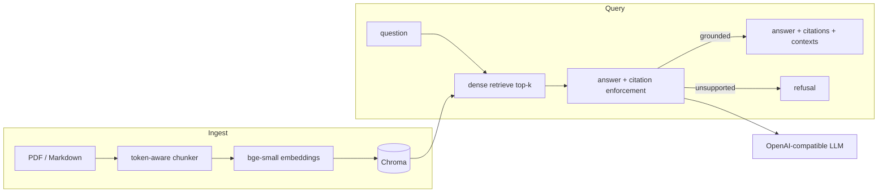

# grounded-rag

A domain-specific "ask-my-docs" system that answers **only** from retrieved evidence,
cites the exact source paragraph, and **refuses** when the documents don't support an
answer. It ships with an automated evaluation harness that fails CI when answer quality
regresses.

> Status: **Phase 1 complete** (cited answers end-to-end). Phase 2 (hybrid + rerank +
> refusal hardening) and Phase 3 (continuous eval + CI gate) to follow.

## Architecture



> Phase 2 adds BM25 + Reciprocal Rank Fusion and a cross-encoder re-ranker between
> `retrieve` and `answer`. The LLM is an OpenAI-compatible endpoint, so Project 2's local
> server plugs in via `GR_OPENAI_BASE_URL` with no code change.

## Quickstart

```bash
make setup                      # uv sync (Python 3.11 toolchain)
cp .env.example .env            # set GR_OPENAI_API_KEY (or point GR_OPENAI_BASE_URL at a local server)
make ingest                     # load data/ -> chunk -> embed -> Chroma
make ask Q="How much PTO do employees accrue per year?"
make run                        # serve POST /ask, GET /health on :8000
```

Ask over HTTP:

```bash
curl -s localhost:8000/ask -H 'content-type: application/json' \
  -d '{"question":"How do I trigger an emergency stop on the Atlas arm?"}' | jq
```

## How grounding works

1. **Retrieve** the top contexts for the question.
2. **Refuse early** if fewer than `GR_REFUSAL_MIN_CONTEXTS` contexts come back.
3. **Generate** with a prompt (`prompts/answer_v1.md`, version pinned in `config.py`) that
   requires every factual sentence to carry an inline citation like `[acme_handbook.md p1 ¶2]`.
4. **Enforce**: after generation, every cited label is checked against the chunks actually
   retrieved. Citations that don't match are dropped; if nothing real remains, the answer
   is replaced with a structured refusal. No grounding → no answer.

## Configuration

All knobs live in `src/grounded_rag/config.py`, sourced from env with the `GR_` prefix
(see `.env.example`): chunk sizes, `top_k`/`top_n`, refusal threshold, model names, store
paths, and the active prompt version.

## Metrics

_Populated in Phase 3 from a real `make eval` run — faithfulness, answer-relevancy,
context-precision, and retrieval hit-rate@k, plus the dense-vs-hybrid-vs-rerank ablation.
No numbers are committed until they come from a real run on this machine._

## Development

```bash
make lint    # ruff + mypy
make test    # pytest
make fmt     # ruff format + autofix
```
